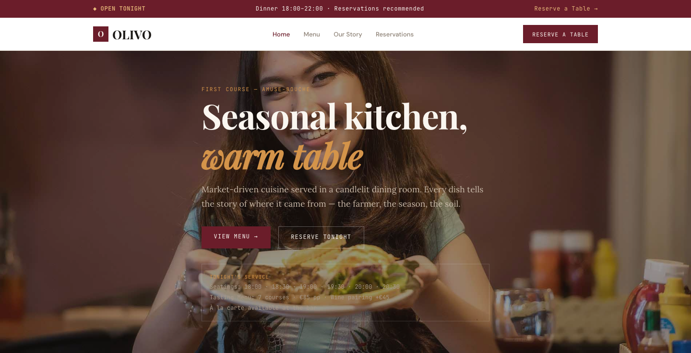

# OLIVO — Seasonal Kitchen & Wine Bar Website Template

A premium, framework-free HTML/CSS/vanilla-JS template for restaurants, bistros, and seasonal dining experiences. Built bespoke from the subject — not a recolored scaffold.

**Live preview:** `index.html` (open in browser)
**Stack:** HTML5 · CSS3 (custom properties, Grid, Flex) · Vanilla JS (no build step)
**Fonts:** Playfair Display (display) · Lora (accent/narrative) · DM Sans (body) · JetBrains Mono (data/labels) — all via Google Fonts
**License:** MIT — use commercially, modify freely.

---

## 📸 Screenshot



## Pages

| Page | Description | Link |
|------|-------------|------|
| **Home** | Reservation bar, hero tasting opening (full-bleed food image), course strip (horizontal scroll), readout stats (4 cells), 6 signature dishes, chef story (feature split), dining gallery (mosaic), testimonials, hours strip, CTA | [index.html](index.html) |
| **Menu** | 7-course tasting menu (dotted-line dish rows, course titles, dietary tags), à la carte section (starters, mains, sides with prices), CTA | [menu.html](menu.html) |
| **Our Story** | Page head, readout stats, chef biography (feature split), 4 philosophy cards, team photos (4 cards), CTA | [about.html](about.html) |
| **Reservations** | Full reservation form (name, email, phone, guests, date, time, dining style, occasion, dietary), location card, hours card, private events card, CTA | [contact.html](contact.html) |

---

## Design Distinction

**This template was authored fresh for a restaurant/seasonal dining subject and diverges from every sibling template on all 6 divergence axes:**

| Axis | OLIVO (this template) | Sibling templates (MERIDIAN, SOURA, AERION, KORVA, VOSSEN) |
|------|----------------------|------------------------------------------------------------|
| **Hero composition** | Full-bleed food imagery with warm overlay, tasting-menu course number label ("First Course — Amuse-Bouche"), spec-box showing tonight's service (seatings, tasting price, wine pairing). Hero reads like opening a tasting menu. | MERIDIAN: newspaper masthead + ticker. SOURA: vertical ledger + glass vessel. AERION: thermostat gauge panel. KORVA: terminal prompt with cursor blink. VOSSEN: blueprint elevation + spec-box. |
| **Layout grammar** | Hospitality grammar: `.reservation-bar` (open tonight) → `.hero-tasting` (full-bleed food) → `.course-strip` (horizontal scroll courses) → `.readouts` (data band) → `.menu-grid` (dish cards) → `.tasting-menu` (dotted-line menu display) → `.gallery-mosaic` (photo grid) → `.hours-strip` (opening times) → `.cta-band`. Content reads like a restaurant evening unfolding. | MERIDIAN: broadsheet multi-column feed. SOURA: vertical ledger + tasting-sheet. AERION: control panel + gauge. KORVA: instrument console + eval ticker. VOSSEN: blueprint drawing set. |
| **Typography personality** | **Playfair Display** (display, elegant serif) + **Lora** (accent, narrative italic) + **DM Sans** (body, clean) + **JetBrains Mono** (prices, labels). Hospitality voice — warm, narrative, inviting. Dotted-line menu items like a printed tasting card. | MERIDIAN: Fraunces/Newsreader (newspaper). SOURA: Fraunces/DM Sans (sommelier). AERION: Barlow Condensed/Inter (industrial). KORVA: Sora/Inter (tech). VOSSEN: Playfair/DM Sans (architectural). |
| **Color logic** | Restaurant warmth: deep burgundy (`--burgundy`), warm amber (`--amber`), cream (`--cream`) on charcoal (`--charcoal`). Amber = candlelight, burgundy = wine, cream = parchment. Not a brand ramp — dining atmosphere reasoning. Olive green accent for vegetarian tags. | MERIDIAN: newsprint paper + kicker-red. SOURA: spring teal + glacier. AERION: cool blue + warm orange. KORVA: dark graphite + signal amber. VOSSEN: blueprint blue + concrete warm. |
| **Motion signature** | Hospitality reveal: `.reveal` (18px translateY), `.pulse-live` (open tonight dot), `.gallery-mosaic` (image scale on hover). Motion is warm and slow — like candlelight flickering. No ticker, no gauge, no pour-line, no cursor blink. | MERIDIAN: clip-path type-set wipe. SOURA: pour-line + bead-pop. AERION: gauge needle tick. KORVA: eval ticker scroll + scan-line. VOSSEN: minimal measured reveal. |
| **Section inventory** | Reservation bar → Hero tasting (full-bleed food) → Course strip (horizontal scroll) → Readouts band → Dish grid (6 cards) → Chef story (feature split) → Dining gallery (mosaic) → Testimonials → Hours strip → CTA → Footer. | MERIDIAN: Topbar → Ticker → Masthead → Feed → Rail. SOURA: Micro-bar → Ledger → Proof → Catalogue. AERION: Statusbar → Gauge → Readouts → Service grid → Emergency. KORVA: Statusbar → Terminal → Eval ticker → Readouts → Arch grid. VOSSEN: Blueprint bar → Elevation → Material strip → Projects grid. |

**Bottom line:** Strip the colors from OLIVO and any sibling — they share **zero** layout grammar, component set, or motion vocabulary. This reads as a restaurant evening unfolding — not a marketing site.

---

## Features

- **Reservation bar** — live "OPEN TONIGHT" indicator with service times
- **Hero tasting** — full-bleed food image, course number label, spec-box (seatings, prices, pairing)
- **Course strip** — horizontal scroll showing tonight's tasting progression
- **Readout stats** — 4-cell data band with count-up animation
- **Signature dishes** — 6 dish cards with image, name, price, description
- **Tasting menu display** — dotted-line menu items, course headers, dietary tags (V/VG)
- **À la carte section** — starters, mains, sides with prices
- **Chef story** — feature split with biography and philosophy
- **Dining gallery** — mosaic photo grid (wide + tall items)
- **Hours strip** — opening times in 4-column grid
- **Testimonials** — 3-column cards with star ratings
- **Contact/reservation form** — guests, date, time, dining style, occasion, dietary, inline validation, no `alert()`
- **Private events card** — capacity, enquiry link
- **Scroll reveals** — IntersectionObserver with staggered delays (`.d1`…`.d4`)
- **Count-up animation** — stats count from 0 to target on scroll
- **Active nav** — auto-highlight via `location.pathname`
- **Footer year** — `[data-year]` auto-fills current year
- **Reduced motion** — `@media (prefers-reduced-motion)` disables all animation
- **Original imagery** — 25 source images from BD-Restaurant (`assets/img/`): `about-us.jpg`, `banner-bg.jpg`, `credit-cards.png`, `logo.png`, `menu-1..9.jpg`, `reservations-bg.jpg`, `slider-1/2/3.jpg`, `team-1..4.jpg`, `testimonial-1/2/3.jpg`, `testimonial-bg.jpg`

---

## Quick Start

```bash
# No install, no build — just open
open index.html
# or serve locally
npx serve .
```

---

## File Structure

```
restaurant-html-template/
├── index.html          # Home page
├── menu.html           # Tasting menu + À la carte
├── about.html          # Our Story / Chef / Team
├── contact.html        # Reservations / Contact
├── assets/
│   ├── css/
│   │   └── base.css    # Bespoke design system (~500 lines)
│   ├── js/
│   │   └── main.js     # Bespoke interactions (~110 lines)
│   └── img/            # 25 original BD-Restaurant images
└── README.md           # This file
```

---

## Customization

- **Colors:** Edit `:root` tokens in `assets/css/base.css` — `--burgundy` (wine), `--amber` (candlelight), `--cream` (parchment), `--charcoal` (dark), `--olive` (vegetarian)
- **Fonts:** Swap Google Fonts `<link>` in each HTML `<head>` and update `--font-display/--font-body/--font-accent/--font-mono`
- **Dishes:** Add/remove `.dish` items in `.course` blocks on menu.html — name, description, price, dietary tag
- **Tasting courses:** Edit `.course` blocks — add/remove courses, change dish names and descriptions
- **Team:** Duplicate `.menu-card` blocks in about.html — change images, names, roles
- **Hours:** Edit the `.hours-strip` section on index.html — change days and times
- **Reservations:** Edit seatings in the `.hero-tasting .spec-box` and `.course-strip` content

---

## Browser Support

Modern evergreen browsers (Chrome 90+, Firefox 88+, Safari 14+, Edge 90+).
Graceful degradation: CSS custom properties, Grid, Flex, `clamp()`, `IntersectionObserver` — all polyfillable if needed.

---

## Credits

- **Images:** Original BD-Restaurant source assets (included in `assets/img/`)
- **Fonts:** Playfair Display (Claus Eggers Sørensen), Lora (Cyreal), DM Sans (Colophon Foundry), JetBrains Mono (JetBrains) — all SIL OFL via Google Fonts
- **Icons:** Inline Unicode (◆ □ ♦ ● ★) — no icon font dependency

---

Let's Build Something Together 🚀
https://tally.so/r/q4q1L9
